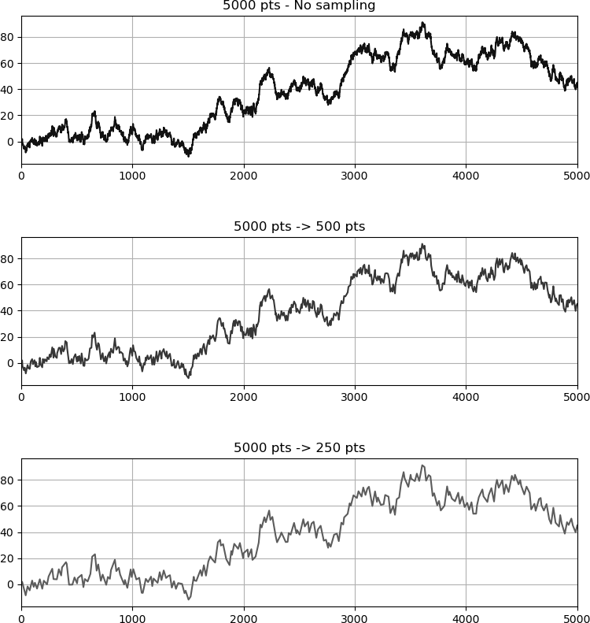

# lttbc: Largest-Triangle-Three-Buckets (Python using a c implementation)   
This is a low-level implementation of the `Largest-Triangle-Three-Buckets` (LTTB) downsampling algorithm written in Python.

The code has been translated from the work of Sveinn Steinarsson (https://github.com/sveinn-steinarsson/flot-downsample/).

## Demo and 'Known Issues'

The examples show the efficiency of the downsampling algorithm with a data set
set of ``5000`` data points down sampled to ``500`` and ``250`` points.

  

Known features and requirements:

- The algorithm requires monotonically increasing x data (finite)
- The algorithm requires finite y data (otherwise problems might occur)
- x and y data have to be of same length (of course)
- The algorithm returns arrays of **dtype** **double**

## Installing

You can also install it [from PyPI](https://pypi.org/project/lttbc/)
to use in other environments with Python 3.5 or later:

    pip install lttbc

## How to use on the field

The module ``lttbc`` differs in the standard input from other largest triangle three buckets implementations.
The ``downsample`` function takes an input for ``x`` and ``y`` in addition to the ``threshold``:

    import lttbc
    import numpy as np

    ARRAY_SIZE = 10000
    THRESHOLD = 1000

    x = np.arange(ARRAY_SIZE, dtype=np.int32)
    y = np.random.randint(1000, size=ARRAY_SIZE, dtype=np.uint64)

    nx, ny = lttbc.downsample(x, y, THRESHOLD)

    assert len(nx) == THRESHOLD
    assert len(ny) == THRESHOLD
    assert nx.dtype == np.double
    assert ny.dtype == np.double

    # List data or a mixture is accepted as well ...
    x = list(range(ARRAY_SIZE))
    y = [np.random.uniform(0, 1000) for _ in range(ARRAY_SIZE)]

    assert isinstance(x, list)
    assert isinstance(y, list)

    nx, ny = lttbc.downsample(x, y, THRESHOLD)

    assert len(nx) == THRESHOLD
    assert len(ny) == THRESHOLD
    assert nx.dtype == np.double
    assert ny.dtype == np.double
