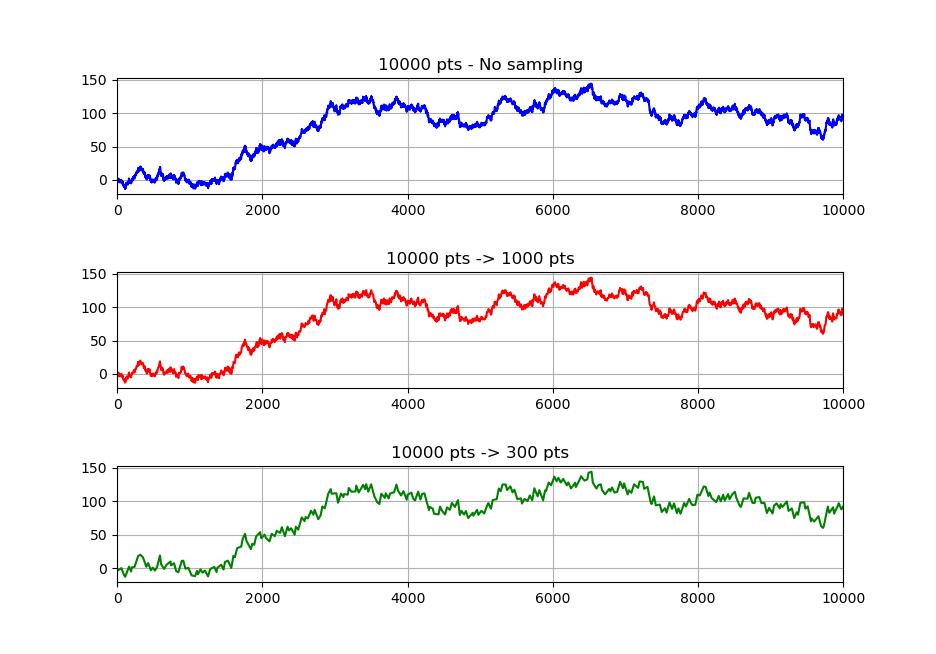

# lttbc: Largest-Triangle-Three-Buckets (Python using a c implementation)

This is a low-level implementation of the `Largest-Triangle-Three-Buckets` (LTTB) downsampling algorithm written in Python.

The code has been translated from the work of Sveinn Steinarsson (https://github.com/sveinn-steinarsson/flot-downsample/).

## Demo

The examples shows the efficiency of the downsampling algorithm with an example
set of ``10000`` data points sampled to ``1000`` and ``300`` points.

  

## Installing

You can also install it [from PyPI](https://pypi.org/project/lttbc/)
to use in other environments with Python 3.5 or later:

    pip install lttbc

## How to use on the field

The module ``lttbc`` differs in the standard input from other largest triangle three buckets implementations.
The ``downsample`` function takes an input for ``x`` as well as ``y``:

    import lttbc
    import numpy as np
    
    ARRAY_SIZE = 10000
    THRESHOLD = 1000
    
    x = np.arange(ARRAY_SIZE, dtype='int32')
    y = np.random.randint(1000, size=ARRAY_SIZE, dtype='uint64')
    
    nx, ny = lttbc.downsample(x, y, THRESHOLD)
    
    assert len(nx) == THRESHOLD
    assert len(ny) == THRESHOLD
    assert nx.dtype == np.double
    assert ny.dtype == np.double
